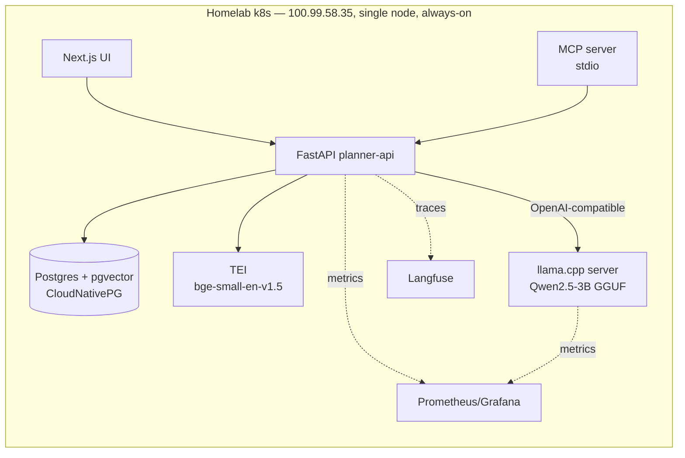
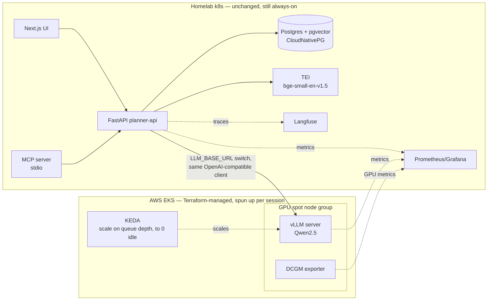

# Hungry — Project Plan

Learning project: small AI app as a thin excuse to build, deploy, scale, observe and
benchmark real infra. Business logic (meal planning) is minimal on purpose — the point
is the platform around it.

## Goal

Build a meal-planning app backed by RAG (recipes in pgvector) + an LLM, served through
an OpenAI-compatible endpoint that can point at **three interchangeable backends**:

1. `llama.cpp` running on the homelab (always-on, free, no GPU acceleration)
2. `vLLM` running on a cloud GPU spot node (later phase, torn down after each session)
3. A hosted API (Claude/OpenAI)

The backend is a config/env switch behind one client — that switch is what makes the
benchmark (Phase 6+) possible: cost, latency and quality compared across all three.

## Architecture

```
Next.js (thin UI) ──► FastAPI "planner-api" ──► Postgres + pgvector (recipes)
                          │
                          ├──► embeddings: TEI, bge-small-en-v1.5 (CPU)
                          └──► LLM, OpenAI-compatible client, switch via config:
                                 ├─ llama.cpp on homelab (default)
                                 ├─ vLLM on cloud GPU spot node (later phase)
                                 └─ hosted API (Claude/OpenAI)

MCP server (stdio) ──► planner-api
Langfuse (self-hosted) ◄── traces
Prometheus/Grafana ◄── metrics (API + inference backend + GPU when applicable)
```

**Split between homelab and cloud:** homelab is the always-on tier (app, DB, embeddings,
default inference, observability — all free, all real K8s learning). Cloud is used only
for the GPU/Terraform phase, spun up and destroyed per session.

## Locked decisions

| Component | Choice | Why |
|---|---|---|
| Self-hosted inference | `llama.cpp` server (OpenAI-compatible mode) on homelab | Homelab GPU is AMD Polaris (RX 470/580) — no ROCm support, vLLM won't run on it. llama.cpp's Vulkan backend does. |
| Local model | Qwen2.5-3B-Instruct, Q4_K_M GGUF | Fits comfortably, faster on old GPU than 7B |
| Embeddings | TEI + bge-small-en-v1.5 | 384-dim, fast on CPU, proven with pgvector |
| Postgres | CloudNativePG operator, in-cluster on homelab | Free, always-on, teaches operator/StatefulSet/PVC/backup patterns instead of offloading to RDS |
| Recipe dataset | Food.com Recipes (Kaggle, ~180k) | Realistic scale, has ingredients/nutrition/tags |
| Cloud provider (GPU phase) | AWS EKS | IRSA/IAM is a strong interview topic, pairs with ECR/Terraform |
| Cloud inference (later) | vLLM on GPU spot node | Continuous batching, PagedAttention, KV-cache/queue metrics — the "core of the project" serving story |
| CI/CD | GitHub Actions, `helm upgrade` via kubeconfig | Simple, push-based, one less moving part while everything else is new |
| Image registry | GitHub Container Registry (ghcr.io) | Free, one auth story for both homelab and EKS pulls |
| Observability traces | Langfuse, self-hosted on homelab | Free, real Helm deploy + Postgres dependency, fits infra-learning goal |
| Observability metrics | kube-prometheus-stack (+ DCGM exporter once GPU exists) | Standard K8s metrics stack |
| Load testing | k6 | Scriptable, integrates with Prometheus/Grafana |
| MCP server | stdio transport | Simplest, no ingress/auth needed for local MCP client use |
| Secrets | K8s Secrets + SOPS-encrypted files in git | Encrypted at rest in repo, decrypted at apply — no extra service |
| Terraform state | S3 backend + DynamoDB lock | Standard, only matters once cloud phase starts |

## Phases

### Phase 0 — Local dev loop
`docker-compose`: FastAPI, Postgres+pgvector, TEI, llama.cpp server. Ingest a slice of
the Food.com dataset. Get `/plan` returning a real structured JSON plan end-to-end,
against llama.cpp first, hosted API as a fallback config.

### Phase 1 — Onto homelab k8s
Helm charts per service. Deploy CloudNativePG, TEI, llama.cpp server, planner-api,
Next.js frontend onto the existing kubeadm cluster. Ingestion becomes a re-runnable
K8s Job. Everything homelab-hosted from here on is the "always-on" tier.

### Phase 2 — CI/CD
GitHub Actions: lint + tests, build images, push to ghcr.io, `helm upgrade` against
homelab kubeconfig on merge to main.

### Phase 3 — Observability
kube-prometheus-stack on homelab. Self-hosted Langfuse (its own Postgres). One Grafana
dashboard covering API latency + llama.cpp throughput. Screenshot goes in the README.

### Phase 4 — MCP server
Thin stdio wrapper exposing `create_plan` and `swap_meal`, calling planner-api.

### Phase 5 — Baseline benchmark
Fixed set of ~50 requests. k6 load test: llama.cpp (homelab) vs hosted API — p50/p95
latency, throughput, cost per 1k plans. Quality check: constraint violations, recipes
not present in DB. First README results table (2-way comparison).

### Phase 6 — Cloud GPU phase (Terraform + EKS)
Terraform: VPC, EKS cluster, CPU node group + GPU spot node group, ECR (if used),
IAM/IRSA, S3 remote state. Deploy vLLM (Qwen2.5-3B or 7B) to the GPU node group,
add it as a third backend option behind the same OpenAI-compatible client switch.
Habit: `terraform destroy` after every session — GPU spot ≈$1/h, EKS control plane
≈$70/mo if left running.

### Phase 7 — Autoscaling
HPA for planner-api. KEDA scaling vLLM on queue depth/pending requests, down to zero
when idle. DCGM exporter for GPU utilization metrics.

### Phase 8 — Full benchmark + evals
Same 50-request set, now 3-way: llama.cpp (homelab) vs vLLM (cloud GPU) vs hosted API.
Cost, latency, TTFT, throughput, quality. Final README table — the make-or-buy story.

### Phase 9 — Polish
SOPS-encrypted secrets wired into CI, README cleanup, remaining rough edges.

## Architecture diagrams

Same app/data/observability tier in both. Only the LLM edge changes — a config switch
(`LLM_BACKEND` + `LLM_BASE_URL`), not a migration.

### Self-hosted (default, Phase 0-5)



### Cloud GPU phase (Phase 6+, spun up/destroyed per session)



## Notes
- Homelab is a single-node kubeadm cluster (v1.34, containerd, Flannel), Tailscale IP
  100.99.58.35 — see `kubernetes-homelab-setup.md`. No HA, no separate worker nodes;
  fine for a learning project, not for anything that needs uptime.
- Cloud phase is intentionally deferred (Phase 6+) so GPU spend only starts once the
  app/data/observability foundation already works on free homelab infra.
