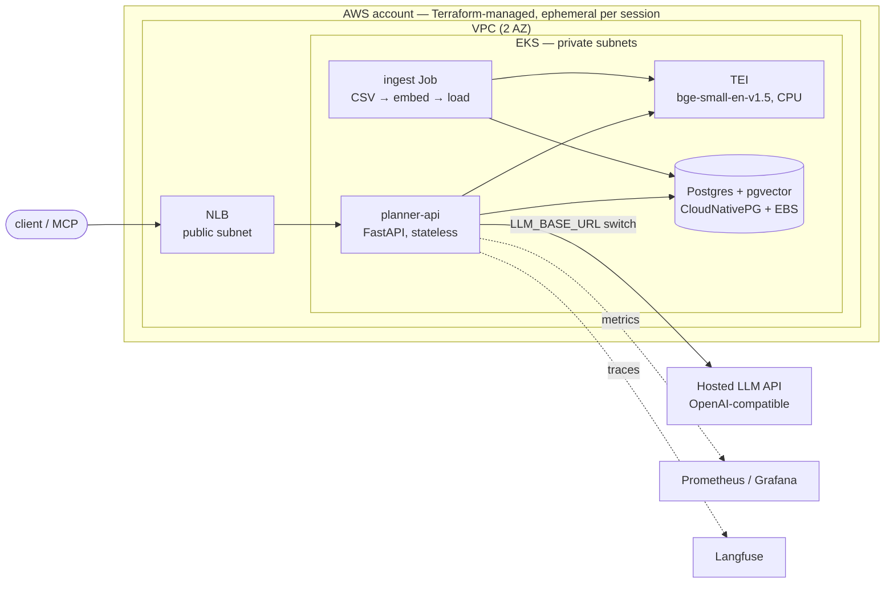

# Hungry — Project Plan

Learning project: a small AI app as a thin excuse to build, deploy, scale, observe and
benchmark real cloud infrastructure. The business logic (meal planning) is minimal on
purpose — the point is the **AI-infra platform** around it, on AWS.

## Goal

A meal-planning app backed by **RAG** (recipes in pgvector) + an **LLM**, served through an
**OpenAI-compatible endpoint** that can point at interchangeable backends behind one client:

1. **Hosted API** (Claude / OpenAI) — the default serving backend.
2. **Self-hosted vLLM** on a GPU node (later phase) — the "build" side of make-vs-buy.
3. **Local llama.cpp** — used only in the Phase 0 dev loop.

The backend is a config/env switch (`LLM_BACKEND` + base URL). That switch is what makes the
benchmark (Phase 5 / 8) possible: cost, latency and quality compared across backends.

## Architecture

Two paths on purpose: the **read path** (client → api → retrieve → generate) is synchronous and
latency-sensitive; the **write path** (ingest Job) is an offline batch load. They scale and fail
differently, so they are separate workloads.

## Locked decisions

| Component | Choice | Why |
|---|---|---|
| Cloud + k8s | **AWS EKS**, Terraform-provisioned | Managed control plane; IRSA/IAM/ECR/EKS are strong interview topics and standard enterprise k8s. |
| Cost posture | **Ephemeral** — `terraform apply` per session, `terraform destroy` after | Rebuildable-from-zero infra; near-zero idle spend (control plane + GPU are the expensive bits). |
| App API | FastAPI `planner-api`, stateless | Horizontally scalable, 12-factor, HPA-friendly. Holds no state. |
| Postgres | **CloudNativePG operator**, in-cluster, on EBS | Teaches operators / StatefulSet / PVC / backups instead of offloading to RDS. Re-ingested each session (ephemeral). |
| Vector search | **pgvector** in the same Postgres | One datastore, SQL-native, fine at this scale. Teaches embeddings + ANN (ivfflat). |
| Embeddings | **TEI + bge-small-en-v1.5** (CPU) | 384-dim, fast on CPU, proven with pgvector. Separate service (different scaling profile). |
| LLM (default) | **Hosted API** behind an OpenAI-compatible client | No serving infra to run yet; the switch enables the later benchmark. |
| LLM (later) | **vLLM** on a GPU spot node group | Continuous batching, PagedAttention, KV-cache/queue metrics — the serving story. |
| Local model (dev) | Qwen2.5-3B-Instruct Q4_K_M GGUF via llama.cpp | Phase 0 only, so the dev loop is free and offline. |
| Storage | **EBS CSI + gp3** StorageClass | Dynamic block volumes for the stateful pods (DB, TEI cache). |
| Ingress | **NLB** via `Service type=LoadBalancer` | L4, simplest single-service entrypoint. ALB/Ingress if L7 routing is later needed. |
| Recipe dataset | Food.com Recipes (Kaggle, ~180k) | Realistic scale; has ingredients/nutrition/tags. |
| Packaging | **Helm** umbrella chart + per-service subcharts | Templated, versioned k8s deploys; hooks drive the re-runnable ingest. |
| CI/CD | GitHub Actions, `helm upgrade` via kubeconfig | Push-based, simple. |
| Image registry | **ghcr.io** | Free, persistent (survives `terraform destroy`), one auth story. |
| Observability traces | Langfuse (self-hosted in-cluster) | Real Helm deploy + Postgres dependency. |
| Observability metrics | kube-prometheus-stack (+ DCGM once GPU exists) | Standard k8s metrics stack. |
| Load testing | k6 | Scriptable, integrates with Prometheus/Grafana. |
| MCP server | stdio transport | Simplest; no ingress/auth needed for a local MCP client. |
| Secrets | K8s Secrets + SOPS-encrypted files in git | Encrypted at rest in the repo, decrypted at apply. |
| Terraform state | Local now → S3 + DynamoDB lock later | Local is fine for ephemeral solo dev; remote state is a Phase 9 nicety. |

## Phases

### Phase 0 — Local dev loop
`docker compose`: FastAPI, Postgres+pgvector, TEI, llama.cpp server. Ingest a slice of the
Food.com dataset. Get `/plan` returning a real structured JSON plan end-to-end.

### Phase 1 — Onto AWS EKS
Terraform: VPC, EKS cluster, CPU managed node group, EBS CSI (IRSA), gp3 StorageClass. Helm
umbrella chart deploying CloudNativePG (pgvector), TEI, and planner-api (hosted LLM backend).
Ingestion is a re-runnable K8s Job (Helm hook). Expose the API via an NLB. Ephemeral: bring the
whole stack up per session and `terraform destroy` after.

### Phase 2 — CI/CD
GitHub Actions: lint + tests, build images, push to ghcr.io, `helm upgrade` against the EKS
kubeconfig on merge to main.

### Phase 3 — Observability
kube-prometheus-stack. Self-hosted Langfuse (its own Postgres). One Grafana dashboard covering
API latency + request throughput. Screenshot in the README.

### Phase 4 — MCP server
Thin stdio wrapper exposing `create_plan` and `swap_meal`, calling planner-api.

### Phase 5 — Baseline benchmark
Fixed set of ~50 requests. k6 load test against the hosted backend — p50/p95 latency,
throughput, cost per 1k plans. Quality check: constraint violations, recipes not present in DB.
First README results table.

### Phase 6 — GPU serving (vLLM)
Terraform: GPU spot node group, DCGM exporter, (ECR if needed). Deploy vLLM (Qwen2.5-3B or 7B)
to the GPU nodes; add it as a backend behind the same OpenAI-compatible switch. Keep the
`terraform destroy` habit — GPU spot ≈ $1/h.

### Phase 7 — Autoscaling
HPA for planner-api. KEDA scaling vLLM on queue depth / pending requests, down to zero when idle.
DCGM exporter for GPU utilization metrics.

### Phase 8 — Full benchmark + evals
Same 50-request set, now multi-way: hosted vs self-hosted vLLM. Cost, latency, TTFT, throughput,
quality. Final README table — the make-or-buy story.

### Phase 9 — Polish
SOPS-encrypted secrets wired into CI. S3 + DynamoDB Terraform backend. README cleanup.

## Notes
- The cluster is **ephemeral** — nothing is left running between sessions. Recipe data is public
  and the ingest Job is re-runnable, so the DB is re-loaded per session rather than persisted.
- Cost is kept near zero by destroying the control plane, nodes, NAT and (later) GPU after each
  session. Images live in ghcr.io and survive teardown.
- See `ARCHITECTURE.md` for the concepts (k8s internals, what AWS runs vs you, IRSA, CSI, operators).
